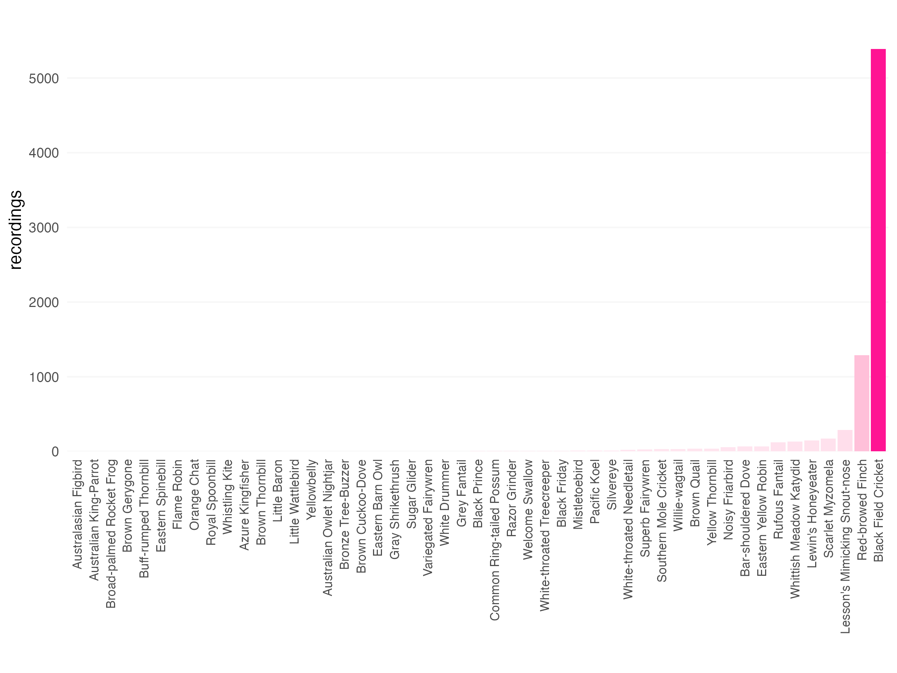
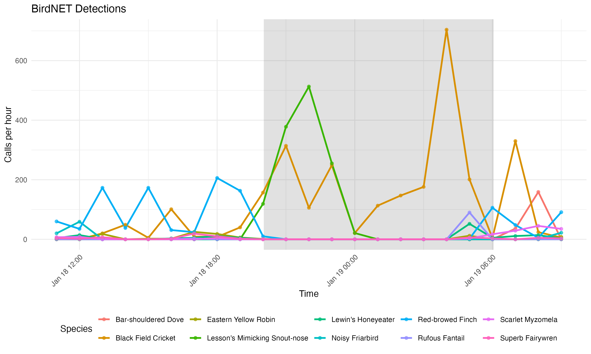
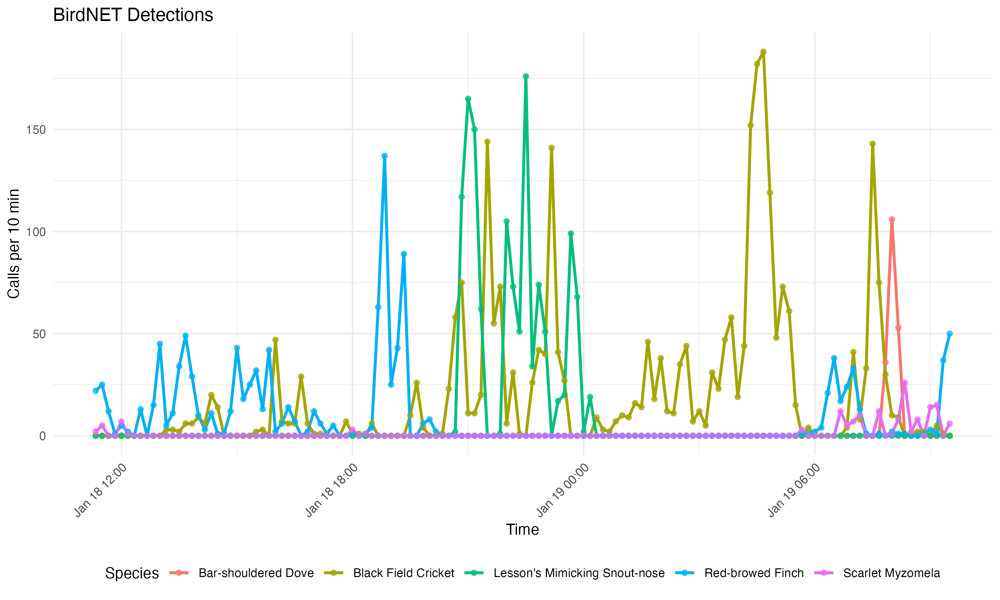

birdnetprocess
================
Will Cornwell
2026-02-18

# birdnetprocess

<!-- badges: start -->

[](https://github.com/traitecoevo/birdnetprocess/actions/workflows/check-standard.yaml)
[](https://github.com/traitecoevo/birdnetprocess/actions/workflows/test-coverage.yaml)
<!-- badges: end -->

`birdnetprocess` helps you process and visualize BirdNET detection
results which can be overwhelming in their volume.

## Install

``` r
# install.packages("devtools") # if needed
devtools::install_github("traitecoevo/birdnetprocess")
#> Using GitHub PAT from the git credential store.
#> Downloading GitHub repo traitecoevo/birdnetprocess@HEAD
#> ── R CMD build ──────────────────────────
#>      checking for file ‘/private/var/folders/1k/cskklf914vd5m3stdrxqyx300000gp/T/RtmptpJSAs/remotesce65569e2f8b/traitecoevo-birdnetprocess-d682817/DESCRIPTION’ ...  ✔  checking for file ‘/private/var/folders/1k/cskklf914vd5m3stdrxqyx300000gp/T/RtmptpJSAs/remotesce65569e2f8b/traitecoevo-birdnetprocess-d682817/DESCRIPTION’
#>   ─  preparing ‘birdnetprocess’:
#>      checking DESCRIPTION meta-information ...  ✔  checking DESCRIPTION meta-information
#>   ─  checking for LF line-endings in source and make files and shell scripts
#>   ─  checking for empty or unneeded directories
#>   ─  building ‘birdnetprocess_0.0.0.9000.tar.gz’
#>      
#> 
```

## Data Requirements

BirdNET produces one output file per audio recording. The package
supports both common output formats:

- **Raven selection tables** (`.txt`, tab-delimited) — must contain
  `Begin Time (s)`
- **BirdNET Analyzer CSV output** (`.csv`, comma-separated) — must
  contain `Start (s)` or `Begin Time (s)`

For automatic time processing, filenames **must** contain a timestamp in
`YYYYMMDD_HHMMSS` format (e.g.,
`SL21_20260118_112124.BirdNET.results.csv`).

------------------------------------------------------------------------

## Use Case 1: Single Site Analysis

This is the most common scenario — you have one recorder deployed at one
location and a folder of BirdNET output files. In this example the
folder is `detections_SL21/` containing ~46 CSV result files.

### Step 1: Read the data

Use `read_birdnet_folder()` to read all BirdNET files in a single folder
and combine them into one tibble:

``` r
library(birdnetprocess)
library(dplyr)

data <- read_birdnet_folder("detections_SL21")
```

**When to use `recursive`?** By default `recursive = FALSE`, which reads
only the files directly in that folder. This is correct for standard
BirdNET output which is flat. Set `recursive = TRUE` only if your
results are split into sub-directories within the site folder.

### Step 2: Quick summary

Get a snapshot of the dataset with `summarise_detections()`:

``` r
summarise_detections(data, confidence = 0.7)
# # A tibble: 7 × 2
#   statistic                   value
#   <chr>                       <chr>
# 1 Number of species           49
# 2 Number of recordings        8042
# 3 Recording window            18 Jan 26 - 19 Jan 26
# 4 Most common species           Black Field Cricket
# 5 Peak hour                   2026-01-19 04:21:02
# 6 Average detections per day  4021
# 7 Average detections per hour 178.7111
```

### Step 3: Visualise

**Species counts** — a quick bar chart of how many detections per
species:

``` r
plot_species_counts(data, confidence = 0.5)
```

<figure>

<figcaption aria-hidden="true">Top 10 Calls</figcaption>
</figure>

**Activity trends with day/night shading** — requires latitude,
longitude, and timezone for the `suncalc` shading:

``` r
plot_top_species(
  data,
  n_top_species = 10,
  confidence = 0.6,
  latitude = -32.44,
  longitude = 152.24,
  tz = "Australia/Sydney"
)
```

<figure>

<figcaption aria-hidden="true">Day Night Patterns</figcaption>
</figure>

**Custom time binning** — by default trends are plotted hourly. Use the
`unit` parameter for finer resolution (any interval `lubridate`
supports, e.g., `"10 min"`, `"30 min"`, `"3 hours"`):

``` r
plot_top_species(
  data,
  n_top_species = 5,
  confidence = 0.5,
  unit = "10 min"
)
```

<figure>

<figcaption aria-hidden="true">10-Minute Trends</figcaption>
</figure>

------------------------------------------------------------------------

## Use Case 2: Multi-Site Project

When you have multiple recorders deployed across different locations,
BirdNET typically outputs results into separate folders — one per site.
In this example we have four site folders: `detections_SL21/`,
`detections_SL25/`, `detections_SL42/`, and `detections_SL_swamp/`.

### Step 1: Identify site folders

You can hard-code the paths or discover them automatically:

``` r
library(birdnetprocess)
library(dplyr)

# Option A: Hard-code folder paths
folders <- c(
  "detections_SL21", "detections_SL25",
  "detections_SL42", "detections_SL_swamp"
)

# Option B: Auto-discover folders matching a pattern
all_dirs <- list.dirs(".", full.names = FALSE, recursive = FALSE)
folders <- all_dirs[grepl("^detections_", all_dirs)]
```

### Step 2: Read all sites

Use `read_birdnet_sites()` — it calls `read_birdnet_folder()` for each
path and adds a **`Site` column** derived from the folder name:

``` r
all_data <- read_birdnet_sites(folders)

# Check the Site column
unique(all_data$Site)
# [1] "detections_SL21"    "detections_SL25"
# [3] "detections_SL42"    "detections_SL_swamp"
```

### Step 3: Compare across sites

Use `facet_by = "Site"` in `plot_top_species()` to get side-by-side
panels — one per site:

``` r
plot_top_species(
  all_data,
  n_top_species = 5,
  confidence = 0.5,
  facet_by = "Site",
  latitude = -32.44,
  longitude = 152.24,
  tz = "Australia/Sydney"
)
```

This produces a faceted plot with each site in its own panel, making it
easy to compare species activity across locations.

------------------------------------------------------------------------

## Quick Reference: Which function should I use?

| Scenario | Function | `recursive` | Adds `Site`? |
|----|----|:--:|:--:|
| One folder of BirdNET results | `read_birdnet_folder()` | `FALSE` (default) | No |
| One folder with sub-directories inside | `read_birdnet_folder()` | `TRUE` | No |
| Multiple site folders for comparison | `read_birdnet_sites()` | `FALSE` (default) | **Yes** |

**Rule of thumb:**

- If you’re working with **one site**, use `read_birdnet_folder()`.
- If you’re **comparing sites**, use `read_birdnet_sites()` — it gives
  you the `Site` column you need for `facet_by = "Site"` in plotting
  functions.

------------------------------------------------------------------------

### Dependencies

Dependencies (lubridate and ggplot2 are key) should be installed
automatically when installing `birdnetprocess` from GitHub.
