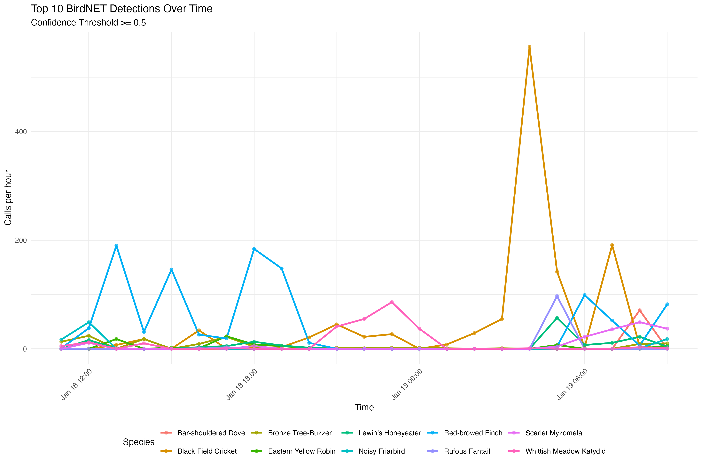

```{r,include=FALSE}
knitr::opts_chunk$set(
  collapse = TRUE,
  comment = "#>"
)
```


# birdnetprocess

<!-- badges: start -->
[](https://github.com/traitecoevo/birdnetprocess/actions/workflows/check-standard.yaml)
[](https://github.com/traitecoevo/birdnetprocess/actions/workflows/test-coverage.yaml)
<!-- badges: end -->

`birdnetprocess` helps you process and visualize BirdNET detection results.

## Install

```{r}
# install.packages("devtools") # if needed
devtools::install_github("traitecoevo/birdnetprocess")
```

## Example Usage
#### 1. Extract Start DateTime from a BirdNET Filename
The function `parse_birdnet_filename_datetime()` assumes filenames follow this pattern:
`SOMETHING_YYYYMMDD_HHMMSS.BirdNET.selection.table.txt` or similar.

The package now supports both:
* **Raven selection tables** (`.txt`, tab-delimited)
* **BirdNET Analyzer CSV output** (`.csv`, comma-separated)

#### 2. Read a Single BirdNET File
Use `read_birdnet_file()` to read one BirdNET selection table.
This will:
* Detect if it's a Raven table (tab-separated) or CSV.
* Parse the filename for the start time.
* Standardize column names (e.g., `Begin Time (s)`).
* Add `start_time` and `recording_window_time` columns.

```{r, message=FALSE, warning=FALSE}
library(birdnetprocess)
library(dplyr)

# Use example data included in the package
raven_path <- system.file("extdata", "example_raven.txt", package = "birdnetprocess")
csv_path <- system.file("extdata", "example_birdnet.csv", package = "birdnetprocess")

# Create a mock filename with a timestamp for demonstration
# (The example files in extdata don't have timestamps in filenames, so we mock it for the reader)
# In real use, your files should look like: SiteA_20240101_120000.BirdNET.selection.table.txt

# We'll just read them directly for now; start_time will be NA if filename doesn't match
df_raven <- read_birdnet_file(raven_path)
df_csv <- read_birdnet_file(csv_path)

head(df_raven)
head(df_csv)
```

**Data Requirements:**
1.  **Filename Format**: For automatic time processing, filenames **MUST** contain a timestamp in the format `YYYYMMDD_HHMMSS` (e.g., `MySite_20240320_060000.BirdNET.txt`).
2.  **File Format**:
    *   **Raven Selection Table**: Tab-delimited `.txt`. Must have `Begin Time (s)`.
    *   **CSV**: Comma-delimited `.csv`. Must have `Start (s)` or `Begin Time (s)`.

#### 3. Quick Visualization and Statistics

`plot_species_counts` and `summarise_detections` provide immediate insights into your data.

**Quick Stats**
Get a summary of your dataset:

```{r}
birdnetprocess::summarise_detections(df_raven, confidence = 0.5)
```

**Quick Calls**
Visualize species counts:

```{r}
birdnetprocess::plot_species_counts(df_raven, confidence = 0.5)
```


### 5. Visualizing Daily Patterns (Day/Night)

You can visualize daily activity patterns with day/night shading (using the `suncalc` package).
Note that you must provide the latitude, longitude, and timezone for the shading to work.

```r
library(birdnetprocess)

# Read data
data <- read_birdnet_folder("path/to/detections_SL21", recursive = FALSE)

# Generate plot with day/night shading
# Example coordinates for Sydney region
birdnetprocess::plot_top_species(
  data,
  n_top_species = 10,
  confidence = 0.5,
  latitude = -32.44,   # Required for suncalc
  longitude = 152.24,  # Required for suncalc
  tz = "Australia/Sydney"
)
```


If you have a folder full of BirdNET files, use `read_birdnet_folder()` to read them all at once.
It will return a single combined tibble.
```{r, eval=FALSE}
# Read all BirdNET files (TXT or CSV) in a directory
all_detections <- read_birdnet_folder(
  folder = "path/to/your/detections/",
  recursive = FALSE
)

dplyr::glimpse(all_detections)
```

Then you can proceed to filter or process as needed for the project. 

### Dependencies

Under the hood, `birdnetprocess` uses:

    - `stringr` for string matching and extraction.
    - `lubridate` for parsing and handling date-time data.
    - `readr` for reading tab-delimited text files.
    - `dplyr` and `purrr` for data manipulation.

These packages should be installed automatically when installing `birdnetprocess` from GitHub.

